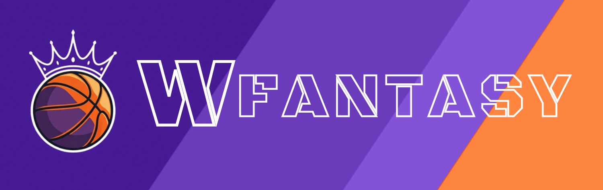

# Welcome to WFantasy!

The Fantasy WNBA App is a user-friendly web application that allows basketball fans to create and manage their own fantasy teams based on WNBA player performances

Users can sign up, log in, build, and monitor rosters within a fixed budget, with player values determined by real stats. 

Built with a Flask backend and React frontend, it integrates modern tools like Fomantic-UI for styling and UseContext for state management. 

The goal is to make a fun, accessible, well-built application that will be deployed for use, and showcase my skills as a software engineer.

<!-- ## Check out the deployed page: -->

## Tech Stack
### Frontend 🖥️
- React (Hooks, useState, useEffect)
- Dnd Kit (Drag-and-drop)
- Fomantic UI React (UI components)
- CSS (Styling)

### Backend 🔧
- Python & Flask (API & authentication)
- SQLAlchemy (Database ORM)
- PostgreSQL (Database)

## Previews:
### Landing Page:

### Draft Portal:

### Team Roster:

### Leaderboard:

### Profile:

## Set Up
### Frontend

Clone the Repository:

```
   git clone https://github.com/your-username/wnba-fantasy-league.git
   cd wnba-fantasy-league/client
```
Install Dependencies:
```
   npm install
```
Run the Frontend:
```
   npm start
```

### Backend
Navigate to Backend Directory:
```
   cd ../server
```
Set Up Virtual Environment:
```
   python3 -m venv venv
   source venv/bin/activate
```
Install Dependencies:
```
   pip install -r requirements.txt
```
Run the Backend:
```
   flask run
```

## What's next?

- Weekly limited trades
- More robust player profiles
- WNBA news
- 